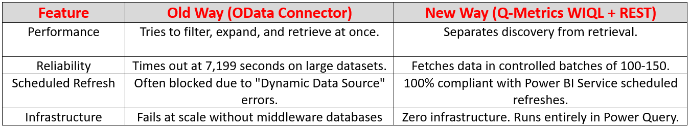
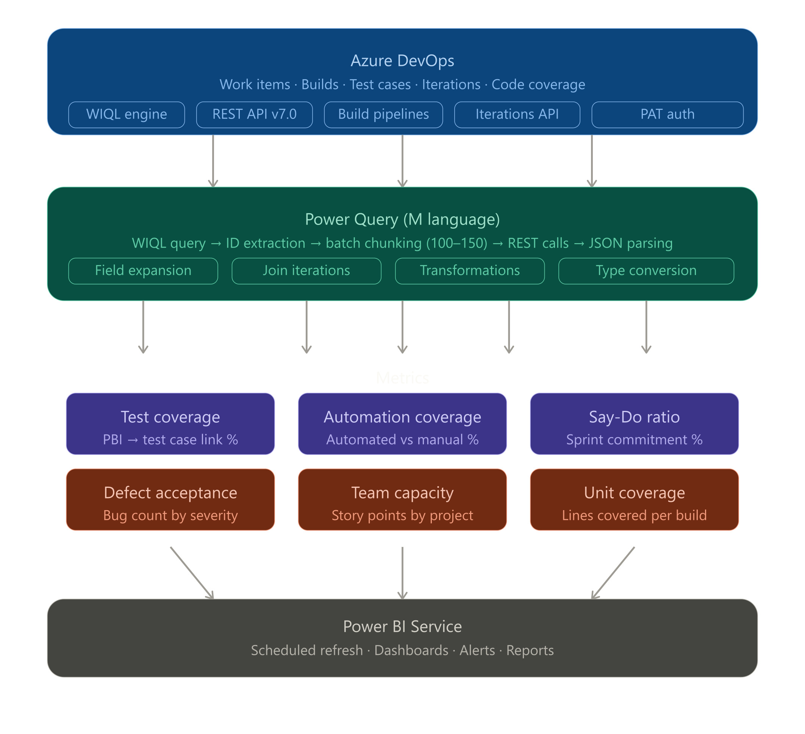
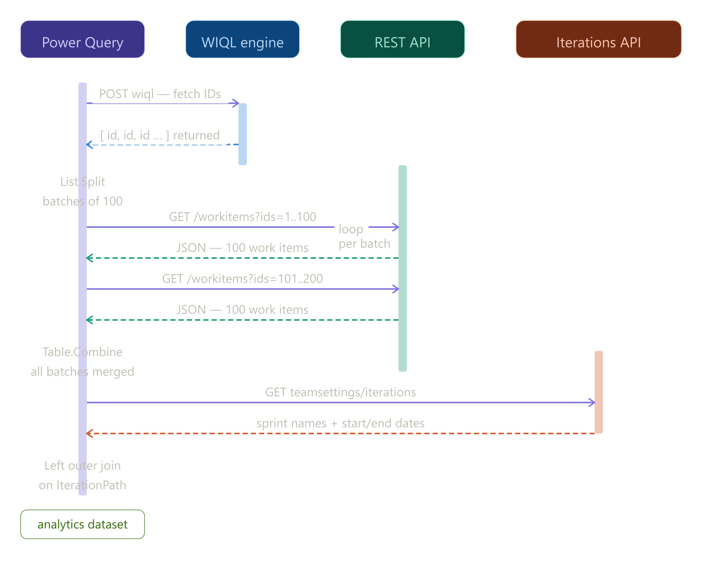

# Q-Metrics: Enterprise Azure DevOps Analytics for Power BI

> A high-performance, massively scalable Power Query architecture for extracting engineering quality metrics from Azure DevOps.

> This approach replaces the fragile built-in OData connector with a lightning-fast WIQL + Azure REST API Batching approach. If your Power BI refreshes are timing out after 2 hours or failing on large datasets, this repository is your solution.

## My Medium Blog: https://medium.com/@jaivadula/why-i-stopped-using-the-odata-connector-and-azure-devops-analytics-view-in-power-bi-and-built-d63337556a2e

---

## The Problem vs. The Solution

As Azure DevOps datasets grow across multiple projects and teams, the standard Analytics View/OData connector breaks down. Power BI Service strictly enforces a refresh execution limit (approx. 7,199 seconds / 2 hours). When you hit it, your analytics fail silently.

We rebuilt the pipeline from the ground up using native REST APIs and M-Code.

---

## How It Works (The Architecture)

Every metric in this repository relies on a two-step handshake within Power Query:

* Discovery (WIQL): We send a Work Item Query Language (WIQL) payload to Azure DevOps. This acts like a SQL query, returning only the IDs of the items we need. It is incredibly fast.

* Retrieval (REST API): We split those IDs into lists of 100–150. We then use the native **_apis/wit/workitems** endpoint to fetch the full JSON payloads in batches, completely bypassing pagination failures and timeouts.

---

Overall Architecture

Sequence Diagram

---

## Questions or Doubts?

If you have any doubts, run into issues during implementation, or just want to discuss this architecture further, feel free to reach out to me! 

* LinkedIn: https://www.linkedin.com/in/jai-vadula/
* Email: jaivadula@gmail.com

---

